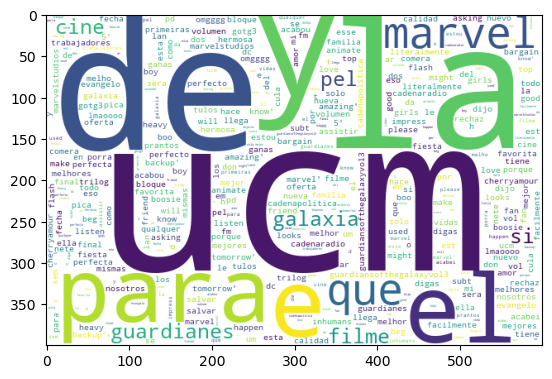

# Erick Bautista - Portfolio
---
# Project 1: Data Engineering (GCP)
---
This is a project I did for ETL in Google Clousd Platform.<br>
Data was a dummy created with Python.

### Technologies Used
- Python, SQL (BigQuery), Google Data Fusion, Looker

### WorkFlow
- Project Design: Draw.io
- Data Generation: Python code
- ETL: GCP Enviroment, Instance, Data Fusion, Pipeline, Big Query
- Data Visualization: Looker

### Design


### Python Code Snippet: Data Loading
```python
import csv
from faker import Faker
import pandas as pd

fake = Faker()

def sanitize_text(text):
    """Removes newlines, extra spaces, and ensures proper formatting."""
    return text.replace('\n', ' ').replace('\r', ' ').replace(',', ' ').strip()


def generate_employee_data(num_employees=1000):
    with open("cleaned_employee_data.csv", "w", newline="", encoding="utf-8") as csvfile:
        fieldnames = [
            "employee_id", "first_name", "last_name", "email", "phone_number", "address", "birthdate", 
            "hire_date", "job_title", "department", "salary", "password"
        ]
```
[View Full Code on GitHub](https://github.com/erickbautista74/GCP_ETL/blob/main/2_src/2.1_ingestion/extract.py)
&nbsp;

### GCP Composer


### GCP Instances

&nbsp;
### GCP Data Fusion Pipeline

&nbsp;
### GCP Big Query

&nbsp;
### GCP Looker

&nbsp;

---
# Project 2: Blood Donor (PySpark|Machine Learning)
---
This is a project I did to Predict if a patient is Hep or not based parameter.<br>
Dataset contains laboratory values of blood donors and Hepatitis C patients and demographic values like age.

### WorkFlow
- Data Prep
- Feature Engineering
- Build Model
- Evaluate

### Feature Engineering
- Numberical Values
- Vectorization
- Scaling

### Technologies
- Google Colab, PySpark, Machine Learning (Linear Regression), Pandas, Numpy, matplotlib, seaborn

### Google Colab code snippet: Pyspark Session
```python
!pip install pyspark

# Load our Pkgs
from pyspark import SparkContext

# Spark
spark = SparkSession.builder.appName("MLwithSpark").getOrCreate()

# Load our dataset
df = spark.read.csv("/content/drive/MyDrive/Colab Notebooks/Data/hcvdata.csv",header=True,inferSchema=True)
```
### Google Colab code snippet: Logistic Model
```python
train_df,test_df = vec_df.randomSplit([0.7,0.3])
from pyspark.ml.classification import LogisticRegression,DecisionTreeClassifier

# Logist Model
lr = LogisticRegression(featuresCol='features',labelCol='Target')
lr_model = lr.fit(train_df)
y_pred = lr_model.transform(test_df)
y_pred.show()
y_pred.select('target','rawPrediction', 'probability', 'prediction').show()
```
### Google Colab code snippet: Model Evaluation
```python
from pyspark.ml.evaluation import MulticlassClassificationEvaluator

# How to Check For Accuracy
multi_evaluator = MulticlassClassificationEvaluator(labelCol='Target',metricName='accuracy')
multi_evaluator.evaluate(y_pred)
from pyspark.mllib.evaluation import MulticlassMetrics
lr_metric = MulticlassMetrics(y_pred['target', 'prediction'].rdd)

print("Accuracy",lr_metric.accuracy)
print("Precision",lr_metric.precision(1.0))
print("Recall",lr_metric.recall(1.0))
print("F1Score",lr_metric.fMeasure(1.0))
```
[View Full Code on GitHub](https://github.com/erickbautista74/Blood_Donor/blob/main/Machine_Learning_with_PySpark.ipynb)
&nbsp;

### Heatmap

&nbsp;
---
# Project 3: Sentiment Analysis on X (Data Science)
---
This is a project I did for Sentiment Analysis on X (Twitter).<br>
Data was get from X through their API. (Sentiment analysis with data from twitter:)

### WorkFlow
- Preparation: textblob, tweepy, pycountry, wordcloud, langdetect
- Authentication for Twitter API
- Getting Tweets With Keyword or Hashtag
- Extracting text values

### Google Colab code snippet: Authentication for Twitter API
```python
auth = tweepy.OAuthHandler(consumerKey, consumerSecret)
auth.set_access_token(accessToken, accessTokenSecret)
api = tweepy.API(auth)
```
### Google Colab code snippet: Getting Tweets With Keyword or Hashtag
```python
for tweet in tweets:
    
    #print(tweet.text)
    tweet_list.append(tweet.text)
    analysis = TextBlob(tweet.text)
    score = SentimentIntensityAnalyzer().polarity_scores(tweet.text)
    neg = score['neg']
    neu = score['neu']
    pos = score['pos']
    comp = score['compound']
    polarity += analysis.sentiment.polarity
```
### Google Colab code snippet: Creating new data frames for all sentiments (positive, negative and neutral)
```python
tw_list_negative = tw_list[tw_list["sentiment"]=="negative"]
tw_list_positive = tw_list[tw_list["sentiment"]=="positive"]
tw_list_neutral = tw_list[tw_list["sentiment"]=="neutral"]
```
[View Full Code on GitHub](https://github.com/erickbautista74/UCM-Twitter/blob/main/axb12940UCMTwitter.ipynb)
&nbsp;
### Sentiment Analysis for word: "UCM"

### Positive Sentiment  for word: "UCM"

### Negative Sentiment for word: "UCM"


---
# Project 4: Data Visualization with Tableau
---
### 1. Sales Analisis in the USA. [see on Public Tableau](https://public.tableau.com/shared/BDRS2R2TM?:display_count=n&:origin=viz_share_link)


### 2. Analysis of Sales and Profitability in EU. [see on Public Tableau](https://public.tableau.com/views/BautistaAXB12940-Final/Q6AXB12940Story?:language=es-ES&:sid=&:redirect=auth&:display_count=n&:origin=viz_share_link)


### 3. Customer Segmentation in the UK. [see on Public Tableau](https://public.tableau.com/views/CustomerSegmentationUK_17389682375610/Story1?:language=es-ES&:sid=&:redirect=auth&:display_count=n&:origin=viz_share_link)


### 4. World Tertiary Education, STEM vs non STEM. [see on Public Tableau](https://public.tableau.com/shared/DSP866RS6?:display_count=n&:origin=viz_share_link)


